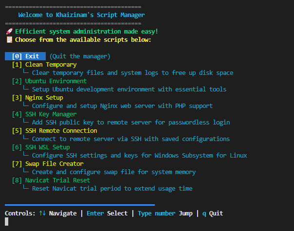

# MyBash - DevOps Automation Toolkit

A comprehensive collection of Bash scripts for automating system administration, development environment setup, and server management tasks on Linux/Ubuntu/WSL2 systems.

## 🚀 Quick Start

```bash
cd ~
mkdir -p mybash
cd mybash
git clone git@github.com:khaizinam/devop-tools.git .
```

```bash
sudo bash app_ui.sh
```

**Note:** Scripts require root privileges. If you're already logged in as root, you can run without sudo:
```bash
bash app_ui.sh
```

## 📸 Screenshot



## 📋 Available Scripts

### 🛠️ System Setup & Environment

#### **Ubuntu Environment** (`install-ubuntu-environment.sh`)
**Description:** Setup Ubuntu development environment with essential tools

A comprehensive menu-driven installer that provides the following options:

- **Install All** - Install all packages in one go
- **Install Nginx (Remove Apache2)** - Install Nginx web server and remove Apache2 if present
- **Install and Configure UFW** - Install UFW firewall and configure default ports (SSH, HTTP, HTTPS) with option to add custom ports
- **Install OpenSSH** - Install and enable OpenSSH server
- **Install Zsh and Oh My Zsh** - Install Zsh shell with Oh My Zsh framework (bira theme)
- **Install Essential Packages** - Install curl, wget, nano
- **Install Docker** - Install Docker Engine and Docker Compose with automatic OS detection (Debian/Ubuntu)
- **Install Snakeoil SSL Certificate** - Install self-signed SSL certificate for local development
- **Install Certbot (Let's Encrypt)** - Install Certbot for managing SSL certificates from Let's Encrypt
- **Install Git** - Install Git with optional global configuration (username, email, pull.rebase)
- **Install Node.js (NVM)** - Install Node.js using NVM with option to install yarn and pm2

**Features:**
- Interactive menu with arrow key navigation
- Reinstall prompts for already installed packages
- Automatic repository fixes (removes broken Cloudflare repo)
- Color-coded output for better readability

---

### 🌐 Web Server

#### **Nginx Setup** (`nginx-setup.sh`)
**Description:** Configure and setup Nginx web server with PHP support

Manages Nginx site configurations with the following features:

- **Create New Project** - Create a new Nginx site configuration
  - Supports PHP projects (with version selection, default 8.2)
  - Supports static HTML projects
  - Optional Git repository cloning
  - Custom root directory configuration (/public_html or /public for Laravel)
  
- **List Projects** - Display all saved project configurations

- **Rebuild from Config** - Recreate Nginx site from existing configuration file

- **Delete Project** - Remove project directory, Nginx config, and clean up

**Configuration:**
- Configurations are stored in `./storage/config/` directory
- Each project has its own `.conf` file with all settings
- Automatic SSL certificate setup (snakeoil)
- Automatic `/etc/hosts` entry creation

---

### 🔐 SSH Management

#### **SSH Remote Connection** (`ssh-remote-server.sh`)
**Description:** Connect to remote server via SSH with saved configurations

Interactive SSH connection manager with scrollable menu:

- **Connection Management:**
  - List all saved SSH configurations
  - Connect to server with saved credentials
  - Edit configuration files (nano/vi)
  - Delete configurations with confirmation
  
- **Features:**
  - Scrollable menu with up to 50 visible items
  - Arrow key navigation + number input for quick selection
  - Password-based authentication with `sshpass`
  - Auto-install `sshpass` if not available
  - Edit config files with your preferred editor

**Storage:**
- Configurations stored in `./ssh_config/` directory
- Format: `USER-HOST.conf` containing USER, HOST, PORT, PASS

---

#### **SSH Key Manager** (`ssh-add-idrsa-key.sh`)
**Description:** Add SSH public key to remote server for passwordless login

Manages SSH key distribution to remote servers:

- **Key Management:**
  - Select from saved SSH public keys
  - Create new SSH public key
  - Upload selected key to remote server
  
- **Configuration Actions:**
  - Add to Server - Upload SSH key to selected server
  - Edit - Edit server configuration (nano/vi)
  - Delete - Remove server configuration
  - Back to Menu - Return to main menu

**Features:**
- Connection testing before key upload
- Automatic `~/.ssh/authorized_keys` management
- Duplicate key detection
- Clear success/error messages

**Storage:**
- SSH keys stored in `./ssh_rsa/` directory
- Configurations stored in `./ssh_config/` directory

---

#### **SSH WSL Setup** (`ssh-setting-wsl.sh`)
**Description:** Configure SSH settings and keys for Windows Subsystem for Linux

Sets up SSH environment for WSL:

- **SSH Agent Management:**
  - Check if SSH agent is running
  - Start SSH agent if not running
  - Persist agent settings in `.bashrc` and `.zshrc`
  
- **Key Management:**
  - Copy SSH keys from `./ssh/` to `~/.ssh/`
  - Set correct file permissions (700 for `.ssh`, 600 for private keys)
  - Add private key to SSH agent
  - Clear existing keys before adding new ones

**Usage:**
- Run from directory containing `.ssh/` folder
- Automatically handles agent lifecycle
- Ensures proper permissions for SSH files

---

### 🧹 System Maintenance

#### **Clean Temporary** (`clean-temporary.sh`)
**Description:** Clear temporary files and system logs to free up disk space

Comprehensive cleanup tool:

- **Temporary Files:**
  - Cleans all files in `/tmp` directory
  - Shows before/after file count
  - Safe removal with error handling
  
- **System Logs:**
  - Removes log files older than 7 days from `/var/log`
  - Shows total space occupied before cleanup
  - Displays space recovered after cleanup
  - Lists all deleted files with sizes

**Features:**
- Color-coded progress indicators
- Detailed statistics
- Safe operation (only old logs removed)

---

### 💾 System Configuration

#### **Swap File Creator** (`system-make-swapfile.sh`)
**Description:** Create and configure swap file for system memory

Creates swap files to extend available memory:

- Prompts for swap file size
- Creates swap file at `/swapfile`
- Sets correct permissions (600)
- Formats as swap
- Enables swap immediately
- Adds to `/etc/fstab` for persistence

**Note:** Requires root privileges for swap operations.

---

#### **Navicat Trial Reset** (`system-reset-trial-navicat.sh`)
**Description:** Reset Navicat trial period to extend usage time

Resets Navicat Premium trial period by removing registry entries:

- Removes Navicat registry keys
- Clears application data
- Extends trial period

**Platform:** Windows/WSL (uses Windows registry commands)

---

## 🎨 User Interface

The toolkit features a modern, interactive UI system:

### Navigation
- **Arrow Keys (↑↓)** - Navigate through menu options
- **Enter** - Select highlighted option
- **Number Keys (0-9)** - Quick jump to option by number
- **Q** - Quit/Exit
- **Ctrl+C** - Graceful exit with cleanup

### Features
- Color-coded output for better readability
- Scrollable menus (up to 50 visible items)
- Input buffering for numeric selection
- Real-time menu updates
- Graceful error handling

---

## 📁 Project Structure

```
mybash/
├── app_ui.sh              # Main interactive script manager
├── README.md              # This file
├── run/                   # Executable scripts
│   ├── clean-temporary.sh
│   ├── install-ubuntu-environment.sh
│   ├── nginx-setup.sh
│   ├── ssh-add-idrsa-key.sh
│   ├── ssh-remote-server.sh
│   ├── ssh-setting-wsl.sh
│   ├── system-make-swapfile.sh
│   └── system-reset-trial-navicat.sh
├── src/
│   ├── services/          # Modular service functions
│   │   ├── common.sh
│   │   ├── install-nginx.sh
│   │   ├── install-ufw.sh
│   │   ├── install-openssh.sh
│   │   ├── install-zsh.sh
│   │   ├── install-essential-packages.sh
│   │   ├── install-docker.sh
│   │   ├── install-snakeoil-cert.sh
│   │   ├── install-certbot.sh
│   │   ├── install-git.sh
│   │   ├── install-node.sh
│   │   ├── clean-tmp.sh
│   │   ├── clean-log.sh
│   │   └── init-nginx.sh
│   └── ui/                # UI components
│       ├── ui_common.sh   # Common UI functions and colors
│       └── scroll_menu.sh # Scrollable menu component
├── config/                # Nginx site configurations
├── ssh_config/            # SSH server configurations
└── ssh_rsa/               # SSH public keys
```

---

## 🔧 Requirements

- **Operating System:** Linux (Debian/Ubuntu recommended), WSL2
- **Privileges:** Root/sudo access
- **Package Manager:** apt-get (Debian/Ubuntu), yum/dnf/pacman (other distros)
- **Dependencies:** 
  - `nano` or `vi` (auto-installed by app_ui.sh)
  - `sshpass` (auto-installed when needed)
  - `curl`, `wget` (installed via Ubuntu Environment script)

---

## 📝 Script Metadata

All scripts support metadata variables:
- `NAME` - Display name for the script
- `DESC` - Description shown in menu

Example:
```bash
NAME="My Script"
DESC="This script does amazing things"
```

If metadata is not present, the script filename (without extension) is used as the name.

---

## 🛡️ Security Notes

- Scripts require root privileges for system modifications
- SSH passwords are stored in plain text configuration files (use with caution)
- Always review scripts before execution
- SSH keys should have proper permissions (600 for private, 644 for public)
- UFW firewall rules should be configured carefully to avoid locking yourself out

---

## 🐛 Troubleshooting

### Script not found
- Ensure you're running from the project root directory
- Check that scripts in `run/` have execute permissions: `chmod +x run/*.sh`

### Permission denied
- Run with sudo: `sudo bash app_ui.sh`
- Ensure you have root/sudo privileges

### Package installation fails
- Check internet connection
- Verify package manager is working: `apt-get update`
- Some scripts auto-fix broken repositories (e.g., Cloudflare 404 errors)

### SSH connection issues
- Verify SSH agent is running: `ssh-add -l`
- Check SSH key permissions: `ls -la ~/.ssh/`
- Test connection manually: `ssh user@host`

---

## 📄 License

This project is for personal use and system administration automation.

---

## 👤 Author

**Khaizinam** - DevOps Automation Toolkit

---

**Last Updated:** 2024
